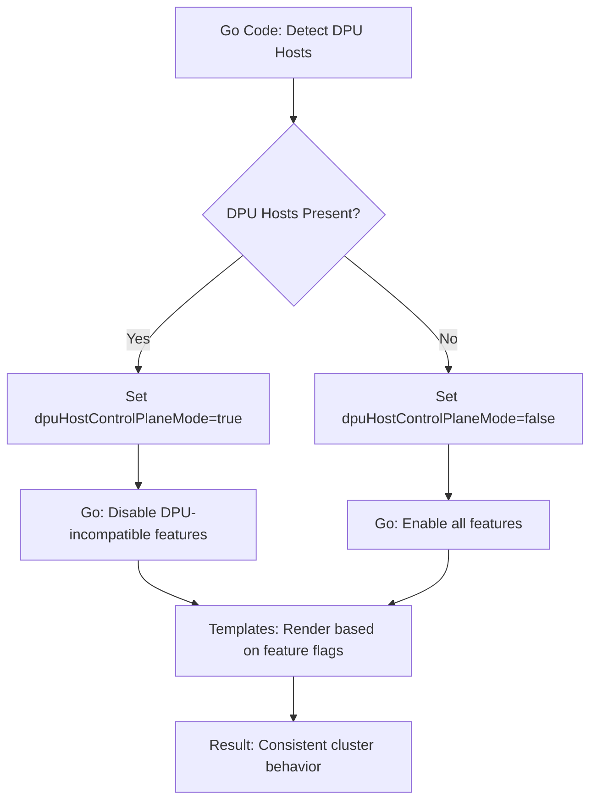

# DPU Host Pure Go Approach - Final Implementation

This document describes the clean, centralized architecture for handling DPU host mode using pure Go code for all feature decisions.

## Architecture Overview

The implementation follows a **pure Go approach** with complete centralization:

1. **Go Code**: Single source of truth for ALL feature enabling/disabling decisions
2. **Templates**: Pure rendering only - no business logic
3. **Result**: Clean, maintainable, and consistent architecture

## Implementation Details

### 1. Single Source of Truth (Go Code)

All feature decisions are made in one place in `pkg/network/ovn_kubernetes.go`:

```go
// Disable DPU-incompatible features when DPU hosts are present
dpuHostControlPlaneMode := bootstrapResult.OVN.OVNKubernetesConfig.DpuHostControlPlaneMode

// Feature gates (disabled when DPU hosts present)
data.Data["OVN_ADMIN_NETWORK_POLICY_ENABLE"] = featureGates.Enabled(apifeatures.FeatureGateAdminNetworkPolicy) && !dpuHostControlPlaneMode
data.Data["OVN_NETWORK_SEGMENTATION_ENABLE"] = featureGates.Enabled(apifeatures.FeatureGateNetworkSegmentation) && !dpuHostControlPlaneMode

// Egress features (disabled when DPU hosts present)  
data.Data["ENABLE_EGRESS_IP"] = !dpuHostControlPlaneMode
data.Data["ENABLE_EGRESS_FIREWALL"] = !dpuHostControlPlaneMode
data.Data["ENABLE_EGRESS_QOS"] = !dpuHostControlPlaneMode
data.Data["ENABLE_EGRESS_SERVICE"] = !dpuHostControlPlaneMode

// Multicast (disabled when DPU hosts present)
data.Data["ENABLE_MULTICAST"] = !dpuHostControlPlaneMode

// Multi-external gateway (disabled when DPU hosts present)
data.Data["ENABLE_MULTI_EXTERNAL_GATEWAY"] = !dpuHostControlPlaneMode

// Multi-network features (disabled when DPU hosts present)
if dpuHostControlPlaneMode {
    data.Data["OVN_MULTI_NETWORK_ENABLE"] = false
    data.Data["OVN_MULTI_NETWORK_POLICY_ENABLE"] = false
}
```

### 2. Pure Template Rendering

Templates now contain **only rendering logic** with no business decisions:

#### ConfigMaps (`004-config.yaml`)
```ini
[ovnkubernetesfeature]
{{- if .ENABLE_EGRESS_IP }}
enable-egress-ip=true
{{- end }}
{{- if .ENABLE_EGRESS_FIREWALL }}
enable-egress-firewall=true
{{- end }}
{{- if .ENABLE_EGRESS_QOS }}
enable-egress-qos=true
{{- end }}
{{- if .ENABLE_EGRESS_SERVICE }}
enable-egress-service=true
{{- end }}
{{- if .ENABLE_MULTICAST }}
enable-multicast=true
{{- end }}
{{- if .OVN_MULTI_NETWORK_ENABLE }}
enable-multi-network=true
{{- end }}
{{- if .OVN_NETWORK_SEGMENTATION_ENABLE }}
enable-network-segmentation=true
{{- end }}
{{- if .OVN_MULTI_NETWORK_POLICY_ENABLE }}
enable-multi-networkpolicy=true
{{- end }}
```

#### Control Plane Templates (`ovnkube-control-plane.yaml`)
```yaml
{{- if .ENABLE_EGRESS_IP }}
--enable-egress-ip=true \
{{- end }}
{{- if .ENABLE_EGRESS_FIREWALL }}
--enable-egress-firewall=true \
{{- end }}
{{- if .ENABLE_EGRESS_QOS }}
--enable-egress-qos=true \
{{- end }}
{{- if .ENABLE_EGRESS_SERVICE }}
--enable-egress-service=true \
{{- end }}
{{- if .ENABLE_MULTICAST }}
--enable-multicast \
{{- end }}
{{- if .ENABLE_MULTI_EXTERNAL_GATEWAY }}
--enable-multi-external-gateway=true \
{{- end }}
```

### 3. Node Scripts (Simplified)

Node scripts simply read the already-processed flags:

```bash
# These flags are already processed by Go code based on DpuHostControlPlaneMode
multi_network_enabled_flag=
if [[ "{{.OVN_MULTI_NETWORK_ENABLE}}" == "true" && "${OVN_NODE_MODE}" != "dpu-host" ]]; then
  multi_network_enabled_flag="--enable-multi-network"
fi

admin_network_policy_enabled_flag=
if [[ "{{.OVN_ADMIN_NETWORK_POLICY_ENABLE}}" == "true" && "${OVN_NODE_MODE}" != "dpu-host" ]]; then
  admin_network_policy_enabled_flag="--enable-admin-network-policy"
fi
```

## Benefits of Pure Go Approach

### ✅ **Single Source of Truth**
- ALL feature decisions in one place (`pkg/network/ovn_kubernetes.go`)
- No scattered conditional logic across templates
- Easy to see exactly what gets disabled when DPU hosts are present

### ✅ **Type Safety & Debugging** 
- Boolean variables instead of string comparisons
- Full Go IDE support and debugging capabilities
- Compile-time validation and error checking

### ✅ **Clean Template Architecture**
```go
// BEFORE: Template logic
{{- if and .OVN_MULTI_NETWORK_ENABLE (ne .DpuHostControlPlaneMode true) }}

// AFTER: Pure rendering  
{{- if .OVN_MULTI_NETWORK_ENABLE }}
```

### ✅ **Consistent Pattern**
- Same approach for ALL settings (no special cases)
- Feature gates and hardcoded settings treated identically
- Uniform architecture across all components

### ✅ **Easy Maintenance**
```go
// Adding new DPU-incompatible feature = single line in Go
data.Data["ENABLE_NEW_FEATURE"] = !dpuHostControlPlaneMode
```

## Feature Control Matrix

| Feature | Go Variable | ConfigMap | Control Plane Args | Node Scripts |
|---------|-------------|-----------|-------------------|--------------|
| **Egress IP** | `ENABLE_EGRESS_IP` | ✅ | ✅ | ✅ |
| **Egress Firewall** | `ENABLE_EGRESS_FIREWALL` | ✅ | ✅ | ✅ |
| **Egress QoS** | `ENABLE_EGRESS_QOS` | ✅ | ✅ | ✅ |
| **Egress Service** | `ENABLE_EGRESS_SERVICE` | ✅ | ✅ | ✅ |
| **Multicast** | `ENABLE_MULTICAST` | ✅ | ✅ | ✅ |
| **Multi-external Gateway** | `ENABLE_MULTI_EXTERNAL_GATEWAY` | ❌ | ✅ | ✅ |
| **Multi-network** | `OVN_MULTI_NETWORK_ENABLE` | ✅ | Script var | Script var |
| **Network Segmentation** | `OVN_NETWORK_SEGMENTATION_ENABLE` | ✅ | Script var | Script var |
| **Multi-network Policy** | `OVN_MULTI_NETWORK_POLICY_ENABLE` | ✅ | Script var | Script var |
| **Admin Network Policy** | `OVN_ADMIN_NETWORK_POLICY_ENABLE` | ❌ | Script var | Script var |

## Decision Flow



## Cluster Behavior

| Scenario | All Components Behavior | Consistency |
|----------|------------------------|-------------|
| **No DPU hosts** | All features enabled | ✅ Perfect |
| **DPU hosts present** | DPU-incompatible features disabled everywhere | ✅ Perfect |

## Features Disabled When DPU Hosts Present

When `dpuHostControlPlaneMode = true`, these features are automatically disabled across ALL cluster components:

- ❌ **Egress Features**: IP, Firewall, QoS, Service
- ❌ **Multicast Support** 
- ❌ **Multi-external Gateway Support**
- ❌ **Multi-network Support**
- ❌ **Network Segmentation**
- ❌ **Multi-network Policies**
- ❌ **Admin Network Policies**

## Summary

The **Pure Go Approach** delivers:

1. **🎯 Single Decision Point**: All feature logic in Go code
2. **🧹 Clean Templates**: Pure rendering, no business logic
3. **🔧 Easy Maintenance**: Adding features requires one line in Go
4. **🎛️ Type Safety**: Boolean logic with IDE support
5. **✅ Perfect Consistency**: Guaranteed cluster-wide feature alignment

This architecture makes the codebase **significantly more maintainable** while ensuring **perfect cluster consistency** when DPU hosts are present.
